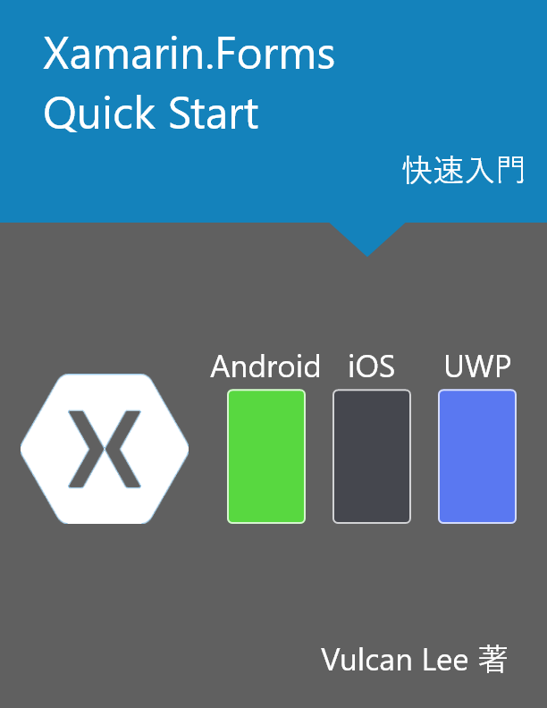

#  Xamarin.Forms 快速入門

##  關於本書

這是一本帶領 Xamarin.Forms 新手開發者，可以透過書中介紹的各種知識、開發技能，配合練習專案實作，快速地學會使用 Xamarin.Forms 這個 UI Toolkit 來進行跨平台的行動應用裝置之應用程式開發工作。

## 這本書能提供什麼

在這本書裡面，將會提供 16 章的內容，分別是

* 開發前的安裝、設定準備工作(共有三章)
  
  對於 Xamarin.Forms 開發新手，第一個學習卡關將會是如何安裝與設定一個可以進行 Xamarin.Forms 的開發環境；在這個部分將會詳細說明如何安裝與設定 Visual Studio 2019 ，使其可以順利的進行 Xamarin.Forms 的開發工作。

* 使用 C# 程式語言來直接開發 Xamarin.Forms App

  說明如何僅使用 C# 程式語言，就可以開發出 Xamarin.Forms 的應用程式的開發過程。

* 使用 XAML 標記宣告語言來開發 Xamarin.Forms App

  說明使用 XAML 宣告標記語言來進行頁面畫面的內容宣告，相關的商業邏輯則是使用 程式碼後置 Code Behind 的方式來開發。

* 資料綁定 Data Binding

  資料綁定 Data Binding是在 Xamarin.Forms 開發上，最為重要的技術，對於資料綁定的類型共有三種，這裡將會針對一般資料物件類型的綁定設計方式來說明如何使用。

* 更多資料綁定的用法

  這裡將會繼續介紹更多關於資料綁定的不同使用方式。

* 數值轉換器 Value Converter

  對於資料綁定的設計方法下，數值轉換器的應用扮演者相當重要的角色，透過設計不同的數值轉換器類別可以設計出許多可重複使用的商業邏輯，並且輕鬆地將不同型別的綁定目標與綁定來源屬性串接在一起。

* 命令綁定 Command Binding

  命令綁定是資料綁定的第二種類型，透過命令綁定可以不再需要使用以往需要透過事件訂閱的設計方式，與在 程式碼後置 區塊來進行相關商業邏輯的程式碼設計工作，全部都轉移到綁定來源的類別物件上。

* 事件轉命令行為 Event to Command Behavior

  Xamarin.Forms 並不是所有的檢視項目都有提供可綁定的命令屬性，但是一定會有提供事件觸發的設計方式，在這裡將會使用 Xamarin.Forms 的一個核心技術 行為 Behaviors，將需要訂閱的事件與命令綁定在一起，這使得當事件被觸發的時候，可以執行所綁定的命令內的委派方法。

* 手勢操作 Gesture Recognizer

  在 Xamarin.Forms 內提供可以與使用者互動的項目不多，按鈕是其中一個，不過， Xamarin.Forms 提供了手勢辨識器功能，可以在讓何檢視項目上，宣告不同的手勢操作行為，當發生了這個手勢操作行為，將會觸發所指定的命令，例如，得知使用者點選了一個圖片 UI 控制項。

* MVVM Model-View-ViewModel 設計模式

  Xamarin.Forms 可以搭配 MVVM 的設計模式，讓 UI 視覺設計與呈現邏輯程式碼與商業邏輯程式碼分隔開來，這樣可以有助於程式開發流程、進行單元測試，因為，這解除了視覺控制項與程式碼之間的緊密耦合關係。

* 內建導航服務

  開發行動應用程式最為重要的設計工作，那就是能夠在不同的頁面之間進行切換，在這裡會先進行 Xamarin.Forms 預設提供的導航服務功能進行介紹，並且了解到更多設計上的問題，可能需要進一步的解決。

* 導航服務之封裝設計

  為了要解決 Xamarin.Forms 預設的導航服務的不足，已經可以在檢視模型中進行各種頁面導航操作，在這裡將會設計一個延伸導航服務類別，解決相關問題，讓開發過程更加的順暢。

* 相依服務 Dependency Service

  Xamarin.Forms 是個 UI 開發工具，它把 UI 設計抽象化了，並且可以讓使用 Xamarin.Forms 設計的 UI 畫面可以在不同平台下來顯示出來，可是，當需要某些功能一定需要透過原生 SDK API 才能夠運作的需求，並且取得原生 SDK API 的執行結果，這個時候就可以透過 Xamarin.Forms 提供的相依服務來滿足這樣的工作。

* 訊息中心 MessagingCenter

  訊息中心是一種 `發行-訂閱` 模式，其中對於 發行者 這個角色可以在不知道任何 訂閱者 的情況下傳送訊息。 同樣地，訂閱者 也可以在不知道任何 發行者 的情況下訂閱特定訊息。透過這樣的特行，可以讓 Xamarin.Forms 的程式順利地執行原生平台下的 SDK API。

## 誰適合閱讀這本書

本書適合想要學會如何使用 Xamarin.Forms 工具來開發出跨平台的行動應用程式的開發者，這裡將會介紹各種 Xamarin.Forms 核心與應用開發技術與技巧，並且帶領大家了解到進階的開發技能，如：檢視模型定位器，延伸導航服務等。透過學習這些開發技術，將會有助於進行各種 Xamarin.Forms 應用程式開發能力的提升。

不過，讀者本身應該要具備 .NET / C# 的開發經驗與程式寫作技能，並且要有使用過 Visual Studio 2019 開發經驗。

這本書的範例專案將會是在 Windows 10 作業系統下，使用 Visual Studio 2019 開發工具開發出來的，由於使用 Xamarin.Forms 開發出來的專案可以在 Android / iOS / UWP 平台下執行，若想要體驗開發出來的專案且在 iOS 模擬器環境下執行效果，讀者需要額外準備一台 Mac 電腦，並且在這台電腦上需要安裝 Xcode 與 Visual Studio for Mac 開發工具。

## 如何使用本書

在書中每個章節都設計了一個練習專案，透過逐步說明的方式來帶領讀者來了解到 Xamarin.Forms 專案是如何進行開發的，了解到為什麼需要使用這樣的開發方式與和其他設計方式差異。

本書中的所有講解範例專案都會放在 Github 上，您可以透過 [Github 的 Xamarin-Forms-Quick-Start](https://github.com/vulcanlee/Xamarin-Forms-Quick-Start) 來取得這些講解範例專案，並且鼓勵大家可以到這個 [Xamarin-Forms-Quick-Start Repository](https://github.com/vulcanlee/Xamarin-Forms-Quick-Start) 頁面，在螢幕的右上方，點選 Start 按鈕給予鼓勵，如同下圖箭頭所指向地方。

## 意見回饋

對於在學習 Xamarin.Forms 開發上，有任何的疑問與問題，可以到 Facebook [Xamarin.Forms @ Taiwan](https://www.facebook.com/groups/XamarinFormstw) 社團與其他 Xamarin.Forms 開發者進行討論。

也建議加入 Facebook [Xamarin 實驗室](https://www.facebook.com/vulcanlabtw/) 粉絲團，作者會經常在這裡貼出各種 Xamarin.Forms 的開發新資訊。

若您對於 Github 範例專案有任何問題，可以在這個 Github Repository [Xamarin-Forms-Quick-Start](https://github.com/vulcanlee/Xamarin-Forms-Quick-Start) 上，建立一個 Issue，作者將會在這上面與您做討論。

# 練習專案說明

|第幾章|介紹內容說明|練習專案|
|-|-|-|
|ch3|Visual Studio 2019 for Xamarin 開發環境之安裝與設定|MyApp|
|ch4|使用 C# 程式語言來直接開發 Xamarin.Forms App|FirstCS|
|ch5|使用 XAML 標記宣告語言來開發 Xamarin.Forms App|FirstXAML , FirstXAMLBasic , FirstXAMLCP , FirstXAMLStyle|
|ch6|資料綁定 Data Binding|Traditional , XAMLBinding , MVVMBase , FodyBase|
|ch7|更多資料綁定的用法 Data Binding|MoreBinding|
|ch8|數值轉換器 Value Converter|BindConverter|
|ch9|命令綁定 Command Binding|CommandBind|
|ch10|事件轉命令行為 Event to Command Behavior|Event2Command|
|ch11|手勢操作 Gesture Recognizer|GestureGame|
|ch12|MVVM Model-View-ViewModel 設計模式|MVVM , MVVMPattern|
|ch13|內建導航服務|NaviBasic|
|ch14|導航服務之封裝設計|NaviService|
|ch15|相依服務 Dependency Service|PlatformInfo|
|ch16|訊息中心 MessagingCenter|StatusBars|

